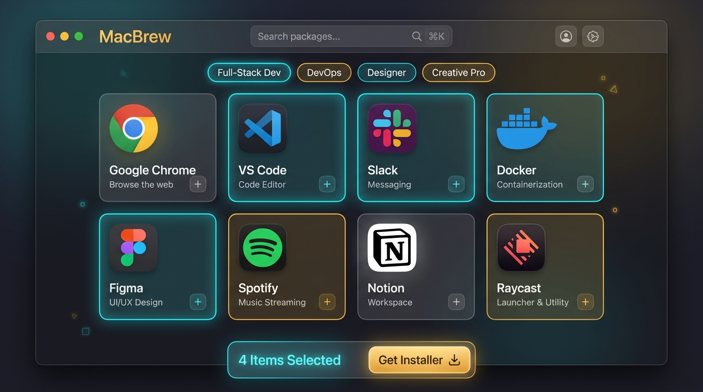

# 🍺 MacBrew — Bulk App Installer for macOS

> Visually select macOS apps & developer tools, then instantly generate terminal commands, official Brewfiles, or automated bash install scripts powered by [Homebrew](https://brew.sh).

[](https://apple.com)
[](https://brew.sh)
[](LICENSE)

<p align="center">
  
</p>

---

## ✨ Features

- ⚡ **Curated Application Directory**: 50+ popular macOS applications & CLI utilities with high-resolution official logos and brand glow indicators.
- 🌐 **Universal Homebrew Search (11,000+ Packages)**: Live integration with Homebrew's official API (`formulae.brew.sh`). Easily search and add **any** Homebrew `cask` or `formula` with zero-scroll instant placement.
- 🚀 **1-Click Preset Setup Bundles**: Pre-configured app bundles for *Full-Stack Developers, DevOps & Cloud Engineers, Designers & Creatives, Power Users, and Minimalists*.
- 📦 **Multi-Format Export Engine**:
  - **One-Liner Command**: Ready to copy-paste directly into macOS Terminal.
  - **Brewfile (`brew bundle`)**: Official Homebrew Bundle format (`cask "google-chrome"`, `brew "git"`).
  - **Interactive Shell Script (`install.sh`)**: Self-contained bash script featuring MacBrew ASCII banner, automatic Homebrew installation check, colored progress indicators, and custom flags (`--no-quarantine`, `brew cleanup`, `brew upgrade`).
- 🔗 **Shareable URL Configuration**: Share team onboarding configurations via URL parameters (e.g. `?apps=visual-studio-code,docker,slack,git,node`).
- 📚 **Built-in Documentation**: Includes a complete `docs.html` guide covering Homebrew concepts, Casks vs Formulae, advanced flags, and FAQs.

---

## 🚀 Quick Start

### 1. Open Directly in Browser
Since MacBrew is built with standard ES6 modules and modern Vanilla CSS, no build steps or Node.js dependencies are required.

Simply open `index.html` in your favorite web browser:
```bash
open index.html
```

### 2. Or Serve via HTTP Server
```bash
python3 -m http.server 8080
```
Then visit [`http://localhost:8080`](http://localhost:8080) in your browser.

---

## 🛠️ How It Works

1. **Select Applications**: Browse categories or search for any package (e.g., `ffmpeg`, `htop`, `neovim`, `vs-code`).
2. **Review Selections**: Use the floating bottom bar to review selected count.
3. **Get Your Installer**: Click **"Obtener Instalador"** to choose your export format:
   - Copy terminal one-liner.
   - Download official `Brewfile`.
   - Download executable `install.sh` bash script.
4. **Execute in Terminal**:
   ```bash
   chmod +x install.sh
   ./install.sh
   ```

---

## 📄 Example Generated `install.sh` Output

```bash
#!/bin/bash
# =============================================================================
# MacBrew — Automated Installation Script for macOS
# Generated at: https://macbrew.app
# =============================================================================

set -e

# 1. Verify Homebrew Installation
if ! command -v brew &> /dev/null; then
  echo "Homebrew not found. Installing Homebrew..."
  /bin/bash -c "$(curl -fsSL https://raw.githubusercontent.com/Homebrew/install/HEAD/install.sh)"
fi

# 2. Install CLI Formulas
brew install "git" "node" "python"

# 3. Install macOS Cask Applications
brew install --cask --no-quarantine "google-chrome" "visual-studio-code" "docker" "slack"

# 4. Cleanup Temp Cache
brew cleanup

echo "🎉 MacBrew installation completed successfully!"
```

---

## 📁 Repository Structure

```
.
├── index.html              # Main MacBrew web application interface
├── styles.css              # macOS Sequoia dark mode & glassmorphism stylesheet
├── docs.html               # Comprehensive user documentation and Homebrew guide
├── docs.css                # Documentation layout stylesheet
├── js/
│   ├── app.js              # Core application controller & event logic
│   ├── data/
│   │   ├── apps.js         # Curated catalog of macOS apps & CLI tools
│   │   ├── presets.js      # Pre-configured developer setup bundles
│   │   └── icons.js        # High-definition vector SVG icon dictionary
│   └── utils/
│       └── generator.js    # Commands, Brewfiles, and install.sh script generator
└── README.md
```

---

## 🤝 Contributing

Contributions are welcome! Feel free to submit pull requests or open issues to add new apps, categories, or features.

1. Fork the repository
2. Create your feature branch (`git checkout -b feature/amazing-feature`)
3. Commit your changes (`git commit -m 'Add amazing feature'`)
4. Push to the branch (`git push origin feature/amazing-feature`)
5. Open a Pull Request

---

## 📜 License

Distributed under the MIT License. See `LICENSE` for more information.
